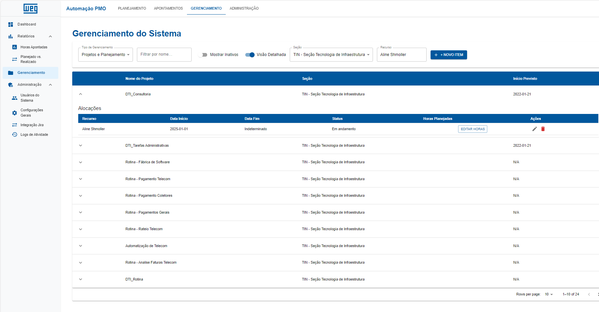

# De Planilhas Manuais à Inteligência de Dados: A Transformação Digital do PMO na WEG

Este documento apresenta a evolução da gestão de projetos e alocação de recursos no PMO da WEG, uma transição de processos manuais e suscetíveis a erros para uma plataforma centralizada, inteligente e em tempo real.

---

### O Desafio: A Gestão Manual

O controle de horas, alocação de recursos e acompanhamento de projetos era realizado em planilhas complexas. Este método, embora funcional, apresentava desafios significativos:

- **Consolidação Manual:** Exigia horas de trabalho para unificar dados de múltiplas fontes.
- **Alto Risco de Erros:** Fórmulas quebradas, dados desatualizados e erros de digitação eram uma constante.
- **Falta de Visibilidade:** Era impossível obter uma visão estratégica e em tempo real da capacidade e alocação das equipes.

**O processo antigo era assim:**

---

### A Solução: Plataforma Integrada de Gestão

Para superar esses desafios, desenvolvemos uma plataforma web moderna que automatiza e centraliza todo o fluxo de gestão do PMO.

**1. Gerenciamento Centralizado:**
Uma interface limpa e intuitiva para gerenciar projetos e as alocações de cada recurso, substituindo a complexidade das abas de uma planilha.

**2. Dashboards Inteligentes e em Tempo Real:**
Visão gerencial completa com KPIs, gráficos de alocação vs. capacidade e mapas de calor que permitem identificar gargalos e oportunidades instantaneamente.

---

### Comparativo de Impacto: Antes vs. Depois

| Antes: Gestão Manual em Excel | Depois: Plataforma Automatizada |
| :--- | :--- |
| ⏳ **Horas** para consolidar dados | ✅ Dados consolidados **automaticamente** |
| 🚨 Alto risco de **erro humano** | 🔒 Validação e **consistência sistêmica** |
| 📉 Visão **estática e retroativa** | 📊 Dashboards **dinâmicos e em tempo real** |
| ❓ Difícil análise de **causa raiz** | 💡 Visão clara por **equipe, projeto e recurso** |

---

### Principais Ganhos e Benefícios

- **Eficiência Operacional:** Redução drástica do tempo gasto em tarefas manuais e repetitivas.
- **Confiabilidade dos Dados:** Eliminação de erros de digitação e fórmulas, garantindo uma fonte única da verdade.
- **Tomada de Decisão Estratégica:** Análises comparativas por mês, equipe e projeto para decisões baseadas em dados.
- **Visibilidade Total:** Identificação instantânea de superalocação e subutilização de recursos.
- **Tecnologia Moderna e Escalável:** Arquitetura robusta com FastAPI (Python) e Next.js (React), pronta para futuras evoluções.

---

### Valor Estratégico para a WEG

> Este sistema não é apenas uma ferramenta, mas uma **transformação cultural**. Ele eleva o PMO de uma área operacional para uma **célula de inteligência estratégica**, permitindo que a WEG otimize o uso de seus talentos, antecipe demandas e mantenha controle total sobre a execução de seus projetos.