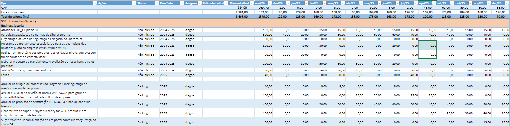
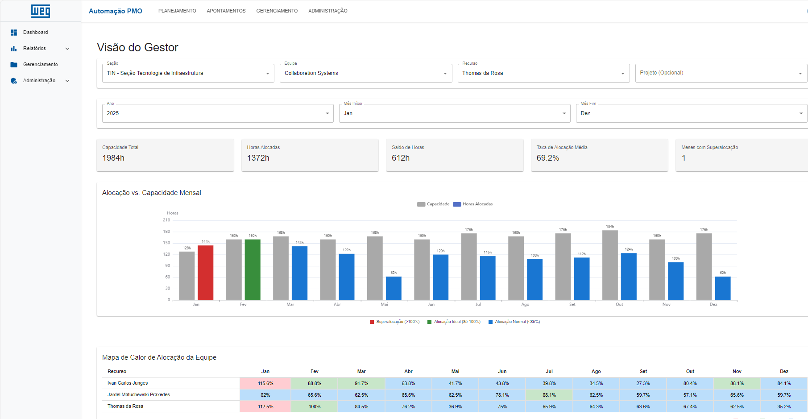

# Otimização Estratégica de Recursos: A Nova Plataforma de Gestão do PMO WEG

Este documento detalha a plataforma desenvolvida para elevar a gestão de projetos e recursos do PMO, transformando dados operacionais em inteligência estratégica. A solução centraliza informações, automatiza processos e fornece visibilidade em tempo real para uma tomada de decisão ágil e fundamentada.

---

### O Legado: A Evolução da Gestão de Projetos

O modelo anterior, baseado em planilhas, foi fundamental para estruturar os processos iniciais de controle do PMO. Ele permitiu a organização de projetos e recursos em um ambiente familiar e flexível. Contudo, com o crescimento da complexidade e do volume de projetos, este modelo atingiu seus limites de escalabilidade, apresentando desafios para a consolidação de dados em tempo real e a análise estratégica integrada.

*Visão do processo legado, que cumpriu seu papel, mas abriu caminho para a evolução.*

---

### A Solução: Plataforma Integrada de Inteligência do PMO

A nova plataforma foi concebida como um hub central de inteligência, projetado para superar os desafios do modelo anterior e potencializar a gestão.

**1. Gestão Centralizada e Fonte Única da Verdade:**
Todos os dados de projetos, equipes e recursos são gerenciados em um único local, garantindo consistência e eliminando a fragmentação da informação. A interface intuitiva simplifica o gerenciamento de alocações e o acompanhamento do progresso.

**2. Automação e Sincronização com o Jira:**
A integração nativa com o Jira automatiza a coleta de apontamentos de horas, reduzindo a zero o esforço de lançamento manual e eliminando inconsistências. Os dados são sempre um reflexo fiel do trabalho realizado.

**3. Dashboards e Relatórios para Visibilidade Estratégica:**
Painéis visuais e relatórios dinâmicos oferecem uma visão clara da saúde dos projetos e da alocação de recursos, permitindo que os gestores identifiquem proativamente gargalos e oportunidades.

*A nova plataforma oferece uma visão gerencial completa e em tempo real.*

---

### Capacidades Analíticas para Decisões Estratégicas

A plataforma habilita uma análise multidimensional que transforma dados brutos em insights acionáveis. Os gestores agora podem responder a perguntas críticas de negócio com precisão:

- **Análise por Período:** Como a nossa capacidade e alocação evoluíram no último trimestre? Qual a tendência para os próximos meses?
- **Análise por Estrutura Organizacional:** Qual é a carga de trabalho atual da Seção X? A Equipe Y possui capacidade para absorver um novo projeto?
- **Análise por Projeto:** Qual o custo real (em horas) do Projeto Z até o momento? Estamos dentro do planejado?
- **Análise por Recurso:** Onde o Colaborador A está alocado nas próximas semanas? Qual a sua taxa de utilização?

---

### Impacto e Valor para a WEG

Esta plataforma representa um salto qualitativo na forma como o PMO opera e gera valor para a companhia.

| Pilar de Transformação | Resultado Estratégico |
| :--- | :--- |
| **Eficiência Operacional** | Automação de tarefas manuais, liberando a equipe para atividades de maior valor agregado. |
| **Confiabilidade da Informação** | Dados precisos e em tempo real, servindo como uma fonte única e confiável para toda a empresa. |
| **Inteligência de Negócio** | Capacidade de realizar análises preditivas e proativas, otimizando a alocação de talentos. |
| **Governança e Controle** | Visibilidade completa sobre o portfólio de projetos, garantindo alinhamento com os objetivos estratégicos. |

> Em suma, a plataforma eleva o PMO de um centro de controle operacional para um **núcleo de inteligência estratégica**, capacitando a WEG a otimizar seus investimentos, maximizar a produtividade de suas equipes e executar seus projetos com excelência.